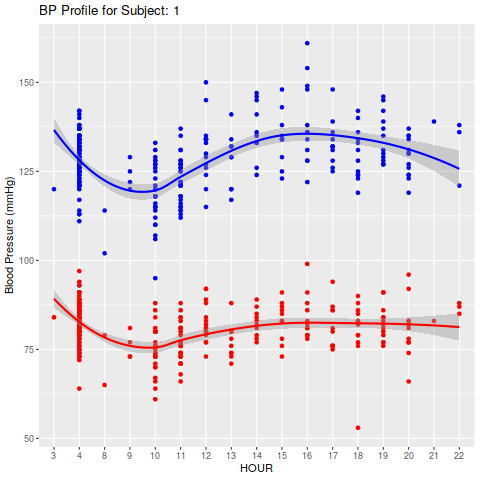
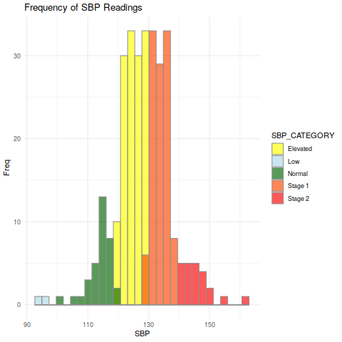
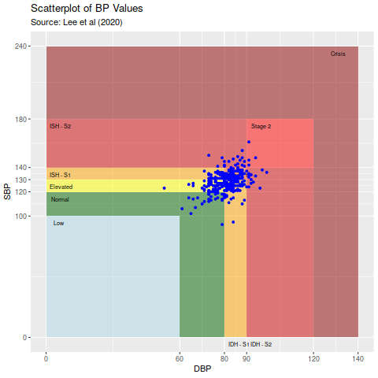
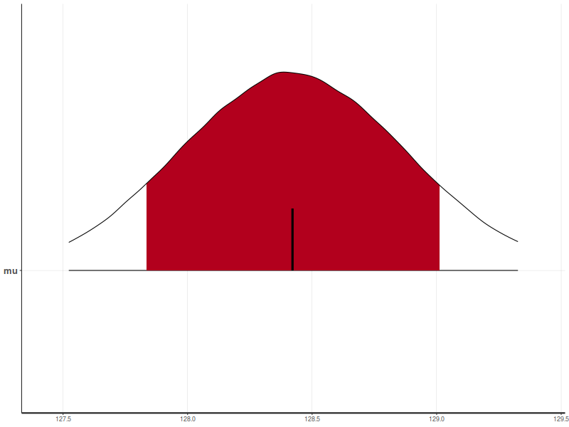

# Data

Load Dataset.

``` r
library(bp)
```

``` r
elias <- read.csv("elias.csv", sep=",")
```

# Fitted Model
``` r 
eliasbp <- process_data(elias,sbp='syst',dbp='diast',date_time='date.time',id='id',hr='hr')
```

# Plots

## LOESS of BP ~ Days


## LOESS of BP ~ Hour




## BP Classification by (Lee et al 2000)


   | BP Stage | Systolic(mmHg) | Diastolic(mmHg) |
   | ---------|:---------------:|-----------------:|
   |  Low (optional) |	<100  |	and 	<60   |
   |  Normal  |	<120 	| and 	<80 |
   |  Elevated |	120 - 129  |	and 	<80|
   |  Stage 1 - All |	130 - 139 |	and 	80 - 89|
   |  Stage 1 - ISH (ISH - S1) | 130 - 139 | 	and 	<80|
   |  Stage 1 - IDH (IDH - S1) |	<130 	|and 	80 - 89 |
   |  Stage 2 - All  |	>140  |	and 	>90|
   |  Stage 2 - ISH (ISH - S2)  |	>140 | 	and 	<90|
   |  Stage 2 - IDH (IDH - S2) |	<140 	| and 	>90 |
   |  Crisis (optional) |	>180 | 	or 	>120|

## All BP values


## Systolic




## Diastolic


## Scatterplot BP  Systolic ~ Diastolic




## Day of Week


## Time of Day


##  American Heart Association Classification

| Blood Pressure Category |	Systolic (mmHg) 	|	Diastolic (mmHg) |
| ---------|:---------------:|-----------------:|                     
|Low (Hypotension) | 	Less than 100  |	and 	Less than 60 |
|Normal            |	100 - 120      |	and 	60 - 80      |
|Elevated 	   |    120 - 129      |	and 	60 - 80      |
|Stage 1 Hypertension | 	130 - 139  |	or 	80 - 89      |
|Stage 2 Hypertension |	140 - 180 	   |or 	90 - 120             |
|Hypertensive Crisis  |	Higher than 180    | 	and/or 	Higher than 120 |


## Systolic 


## Diastolic


# Blood Pressure Metrics

## Coefficient of Variation (Munter et al 2011)


## Average Real Variability (Mena et al 2005)


## Successive Variation (Munter et al 2011)


## Blood Pressure Magnitude (peak and trough) (Munter et al 2011)


# Bayesian Playground

## Systolic

````{verbatim}
data{
int<lower=1> N;
real y[N];
real nu;
}
parameters{
real<lower=50,upper=200> mu;
real<lower=0> tau;
}
transformed parameters{
real<lower=0> sigma;
sigma = sqrt(1/tau);
}
model{
for(i in 1:N){
y[i] ~ student_t(nu,mu,sigma);
}
mu ~ uniform(50,200);
tau ~ gamma(0.001,0.001);
}
````

````{verbatim}
## Inference for Stan model: anon_model.
## 4 chains, each with iter=1e+05; warmup=50000; thin=1; 
## post-warmup draws per chain=50000, total post-warmup draws=2e+05.
## 
##          mean se_mean   sd    2.5%     25%     50%     75%   97.5%  n_eff Rhat
## mu     132.88       0 0.87  131.17  132.30  132.88  133.46  134.56 189484    1
## tau      0.03       0 0.01    0.02    0.02    0.02    0.03    0.04 182654    1
## sigma    6.43       0 0.69    5.19    5.94    6.38    6.86    7.91 184791    1
## lp__  -191.68       0 1.01 -194.41 -192.06 -191.37 -190.96 -190.70  93303    1
## 
## Samples were drawn using NUTS(diag_e) at Sun Apr  9 22:51:46 2023.
## For each parameter, n_eff is a crude measure of effective sample size,
## and Rhat is the potential scale reduction factor on split chains (at 
## convergence, Rhat=1).
````



## Diastolic

````{verbatim}
data{
int<lower=1> N;
real y[N];
real nu;
}
parameters{
real<lower=60,upper=100> mu;
real<lower=0> tau;
}
transformed parameters{
real<lower=0> sigma;
sigma = sqrt(1/tau);
}
model{
for(i in 1:N){
y[i] ~ student_t(nu,mu,sigma);
}
mu ~ uniform(60,100);
tau ~ gamma(0.001,0.001);
}
````

````{verbatim}
## Inference for Stan model: anon_model.
## 4 chains, each with iter=1e+05; warmup=50000; thin=1; 
## post-warmup draws per chain=50000, total post-warmup draws=2e+05.
## 
##          mean se_mean   sd    2.5%     25%     50%     75%   97.5%  n_eff Rhat
## mu      82.44       0 0.64   81.19   82.01   82.44   82.87   83.70 186568    1
## tau      0.05       0 0.01    0.03    0.04    0.05    0.05    0.07 184241    1
## sigma    4.66       0 0.48    3.80    4.32    4.63    4.96    5.68 185257    1
## lp__  -165.48       0 1.01 -168.20 -165.87 -165.17 -164.76 -164.50  91808    1
## 
## Samples were drawn using NUTS(diag_e) at Sun Apr  9 22:52:02 2023.
## For each parameter, n_eff is a crude measure of effective sample size,
## and Rhat is the potential scale reduction factor on split chains (at 
## convergence, Rhat=1).
````


