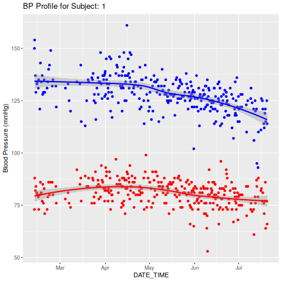
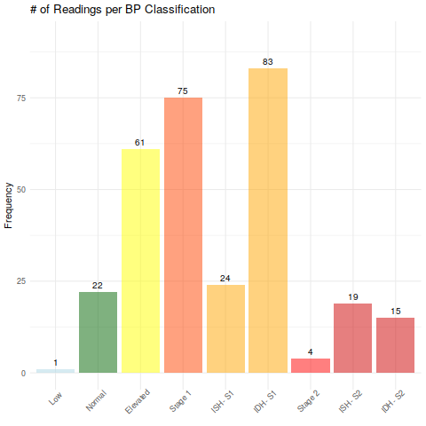

# Data

Load Dataset.

``` r
library(bp)
```

``` r
elias <- read.csv("elias.csv", sep=",")
```

# Fitted Model
``` r 
eliasbp <- process_data(elias,sbp='syst',dbp='diast',date_time='date.time',id='id',hr='hr')
```

# Plots

## LOESS of BP ~ Days

``` r 
bp_ts_plots(eliasbp)[[1]]
```



## LOESS of BP ~ Hour


``` r
bp_ts_plots(eliasbp)[[2]]
```


## All BP values


``` r 
bp_hist(eliasbp)[[1]]
```

## BP Classification by (Lee et al 2000)




   | BP Stage | Systolic(mmHg) | Diastolic(mmHg) |
   | ---------|:---------------:|-----------------:|
   |  Low (optional) |	<100  |	and 	<60   |
   |  Normal  |	<120 	| and 	<80 |
   |  Elevated |	120 - 129  |	and 	<80|
   |  Stage 1 - All |	130 - 139 |	and 	80 - 89|
   |  Stage 1 - ISH (ISH - S1) | 130 - 139 | 	and 	<80|
   |  Stage 1 - IDH (IDH - S1) |	<130 	|and 	80 - 89 |
   |  Stage 2 - All  |	>140  |	and 	>90|
   |  Stage 2 - ISH (ISH - S2)  |	>140 | 	and 	<90|
   |  Stage 2 - IDH (IDH - S2) |	<140 	| and 	>90 |
   |  Crisis (optional) |	>180 | 	or 	>120|

## Systolic

``` r
bp_hist(eliasbp)[[2]]
```


## Diastolic

``` r
bp_hist(eliasbp)[[3]]
```


## Scatterplot BP  Systolic ~ Diastolic

``` r
bp_scatter(eliasbp)
```


##  American Heart Association Classification

| Blood Pressure Category |	Systolic (mmHg) 	|	Diastolic (mmHg) |
| ---------|:---------------:|-----------------:|                     
|Low (Hypotension) | 	Less than 100  |	and 	Less than 60 |
|Normal            |	100 - 120      |	and 	60 - 80      |
|Elevated 	   |    120 - 129      |	and 	60 - 80      |
|Stage 1 Hypertension | 	130 - 139  |	or 	80 - 89      |
|Stage 2 Hypertension |	140 - 180 	   |or 	90 - 120             |
|Hypertensive Crisis  |	Higher than 180    | 	and/or 	Higher than 120 |


```r
eliasstages <- bp_stages(elias,sbp='syst',dbp='diast',bp_type="ap")
dummysbp <- table(eliasstages$SBP_CATEGORY)
dummydbp <- table(eliasstages$DBP_CATEGORY)
sbpstages <- c(dummysbp[2], dummysbp[1],dummysbp[3],dummysbp[4])
dbpstages <- dummydbp
```

## Systolic 

```r 
barplot(sbpstages,col=c("green","yellow","orange","red"))
grid(nx=NA,ny=NULL)
```


## Diastolic

``` r
barplot(dbpstages,col=c("green","orange","red"))
grid(nx=NA,ny=NULL)
```


